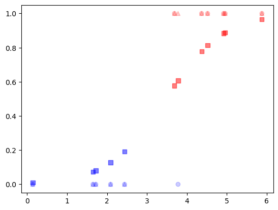
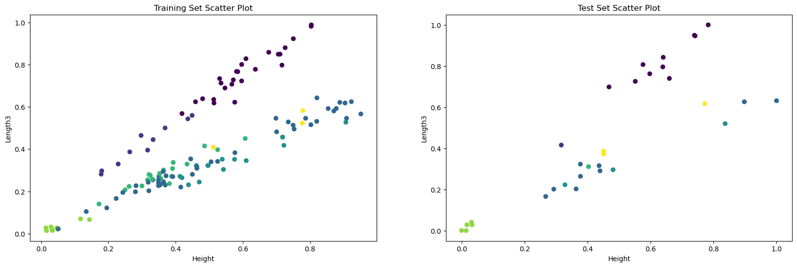
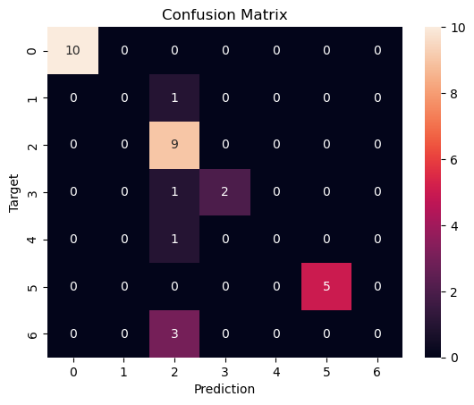

Let’s take a simple example for healthcare: given an array of breast tumor sizes, and an array of targets in which y = 1 means it is a cancerous tumor and y = 0 means it is a benign tumor. We can train a logistic regression on this small dataset and make use of sklearn’s predict and predict_proba method. Predict gives hard classification (the results are forced into 0 and 1) while predict_proba gives soft classification (the results are probability of belonging into positive prediction)


```python
import numpy
from sklearn import linear_model
import matplotlib.pyplot as plt

X = numpy.array([3.78, 2.44, 2.09, 0.14, 1.72, 1.65, 4.92, 4.37, 4.96, 4.52, 3.69, 5.88]).reshape(-1,1)
y = numpy.array([0, 0, 0, 0, 0, 0, 1, 1, 1, 1, 1, 1])

logr = linear_model.LogisticRegression()
logr.fit(X,y)
y_pred=logr.predict(X)
print(y_pred)
y_pred_soft=logr.predict_proba(X)
print(y_pred_soft)
```

    [1 0 0 0 0 0 1 1 1 1 1 1]
    [[0.39250045 0.60749955]
     [0.80731124 0.19268876]
     [0.87224114 0.12775886]
     [0.99044779 0.00955221]
     [0.91961384 0.08038616]
     [0.92654363 0.07345637]
     [0.11637257 0.88362743]
     [0.22098622 0.77901378]
     [0.11075591 0.88924409]
     [0.18706503 0.81293497]
     [0.42280871 0.57719129]
     [0.03335757 0.96664243]]


The first observation is incorrectly classified as a dangerous case in the hard classification algorithm. In the soft version (probabilistic), the propensity of having cancer is only 61%, the graph below shows how soft the prediction becomes using the logistic function:


```python
colors=[]
y_max=[]
for i in y_pred_soft:
    y_max.append(i[1])
    if i[0]>i[1]:
        colors.append('b')
    else:
        colors.append('r')
```


```python
plt.scatter(X,y,alpha=0.2,color=['b','b','b','b','b','b','r','r','r','r','r','r'])
plt.scatter(X,y_pred,marker='^',alpha=0.2,color=['r','b','b','b','b','b','r','r','r','r','r','r'])
plt.scatter(X,y_max,marker='s',alpha=0.5,color=colors)
```


    <matplotlib.collections.PathCollection at 0x7fc1b03d6490>


    

    


```python

```

Another example uses a fish data set. We have a dataset that classified fish into 7 categories. We preprocess data by using a scaler and encode the label into numbers. Then we split the data into a train and a test set, for the sake of validating. 


```python
dataset_url = "https://raw.githubusercontent.com/harika-bonthu/02-linear-regression-fish/master/datasets_229906_491820_Fish.csv"
import pandas as pd
from sklearn.preprocessing import MinMaxScaler
from sklearn.preprocessing import LabelEncoder
from sklearn.model_selection import train_test_split
from sklearn.linear_model import LogisticRegression
from sklearn.metrics import accuracy_score
import matplotlib.pyplot as plt
import seaborn as sns
import matplotlib.pyplot as plt
import seaborn as sns
from sklearn.metrics import confusion_matrix


fish = pd.read_csv(dataset_url, error_bad_lines=False)
X = fish.iloc[:, 1:]
y = fish.loc[:, 'Species']
scaler = MinMaxScaler()
scaler.fit(X)
X_scaled = scaler.transform(X)
label_encoder = LabelEncoder()
y = label_encoder.fit_transform(y)
X_train, X_test, y_train, y_test= train_test_split(X_scaled, y, test_size=0.2, random_state=42)

```

    /var/folders/kf/5_ggvsz93vxdbx_h0tvy66xh0000gn/T/ipykernel_7272/3805894089.py:15: FutureWarning: The error_bad_lines argument has been deprecated and will be removed in a future version. Use on_bad_lines in the future.
    
    
      fish = pd.read_csv(dataset_url, error_bad_lines=False)


    

    


When we plot the scatters of the train and test set, we see a similar distribution. This is a good sign, since we would like our training set to be close to the test set, this would reduce error. 


```python
plt.figure(figsize = (20, 6))
plt.subplot(1, 2, 1)
plt.scatter(X_train[:,5], X_train[:,4], c = y_train)
plt.xlabel('Height')
plt.ylabel('Length3')
plt.title('Training Set Scatter Plot')
plt.subplot(1, 2, 2)
plt.scatter(X_test[:,5], X_test[:,4], c = y_test)
plt.xlabel('Height')
plt.ylabel('Length3')
plt.title('Test Set Scatter Plot')
plt.show()


```


    

    


Then we run the logistic regression estimator from sklearn. The accuracy is 81.25% and we plot the confusion matrix. The confusion matrix is a visual representation to check how correct we are at our prediction. For example, number 3 in the bottom row of the matrix means that there are 3 predictions for the input in class number 2 but the real targets turn out to belong to class number 6. Then we retrieve the importance of each feature, the “Height” attribute/feature is the most important one, contributing 77% of the prediction information. Then comes the Length3.


```python
# training the model
clf = LogisticRegression()
clf.fit(X_train, y_train)
y_pred = clf.predict(X_test)

accuracy = accuracy_score(y_test, y_pred)
print("Accuracy: {:.2f}%".format(accuracy * 100))
cf = confusion_matrix(y_test, y_pred)
plt.figure()
sns.heatmap(cf, annot=True)
plt.xlabel('Prediction')
plt.ylabel('Target')
plt.title('Confusion Matrix')

```

    Accuracy: 81.25%


    Text(0.5, 1.0, 'Confusion Matrix')


    

    


```python
clf.coef_[0]

```


    array([ 0.34202933, -0.0568451 ,  0.04333105,  0.60957822,  3.81719467,
            0.18893405])


```python
X.columns
```


    Index(['Weight', 'Length1', 'Length2', 'Length3', 'Height', 'Width'], dtype='object')


```python

```
