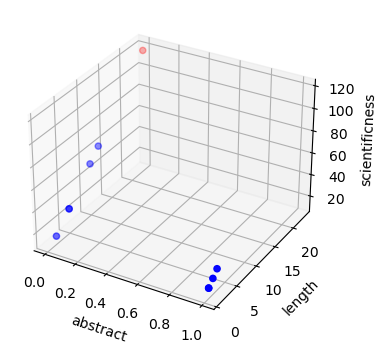

Consider an original perceptron, with 2 inputs and 1 output, all of which are binary, and in this example the perceptron would be used to classify document: whether the document is a scientific one or not. The input 1 would be whether the document has an abstract part. And the second input is the length of the document.

We have 10 documents in the library to classify, with the following characteristics:


```python
abstract = [0, 1, 0, 0, 0, 0, 1, 1, 1, 0]
length = [12, 1, 2, 5, 23, 10, 1, 2, 3, 5]

```

Since the abstract is something that defines hence determines the scientificness of a paper, we would weight that factor stronger by giving it a multiplicative factor of w1 = 7. We grade the length at the importance of w2 = 5. For random reason, let's say there is an amount of w0 = 3 accounting for things we don't know. Now we need to compute this equation: y = w0 + w1 * abstract + w2 * length. 


```python
w1 = 7
w2 = 5
w0 = 3
w = [w1, w2, w0]
```

Let's start by sorting the first document, with no abstract and length of 12 pages.


```python
y = 7 * 0 + 12 * 5 + 3
```


```python
y
```


    63


We pick a threshold for the scientific document to be 75, hence this document is not qualified. That's it! That's how the perceptron works. Of course, in general, and nowsaday, neurons don't work alone like this, there are networks of neurons that have complex architecture and they are used to solve complex tasks.

Now let's use numpy package in python to make all the computation at once. First, turn the normal arrays into a numpy arrays, turning them into column vectors when neccessary.


```python
import numpy as np
x1 = (np.array(abstract)).reshape(-1,1)
x2 = (np.array(length)).reshape(-1,1)
x3 = (np.ones(10)).reshape(-1,1)
```


```python
x=np.append(x1, x2, axis=1)
x=np.append(x, x3, axis=1)
```


```python
y = np.dot(x,w)
y
```


    array([ 63.,  15.,  13.,  28., 118.,  53.,  15.,  20.,  25.,  28.])


With all the y computed, let's plot them. Any documents that passed 75 point would be colored


```python
colors = []
for e in y:
  if e > 75:
    colors.append('r')
  else:
    colors.append('b')

fig = plt.figure()
ax = fig.add_subplot(projection='3d')

ax.scatter(x[:,0], x[:,1], y,color=colors)

ax.set_xlabel('abstract')
ax.set_ylabel('length')
ax.set_zlabel('scientificness')

plt.show()
```


    

    


```python

```
