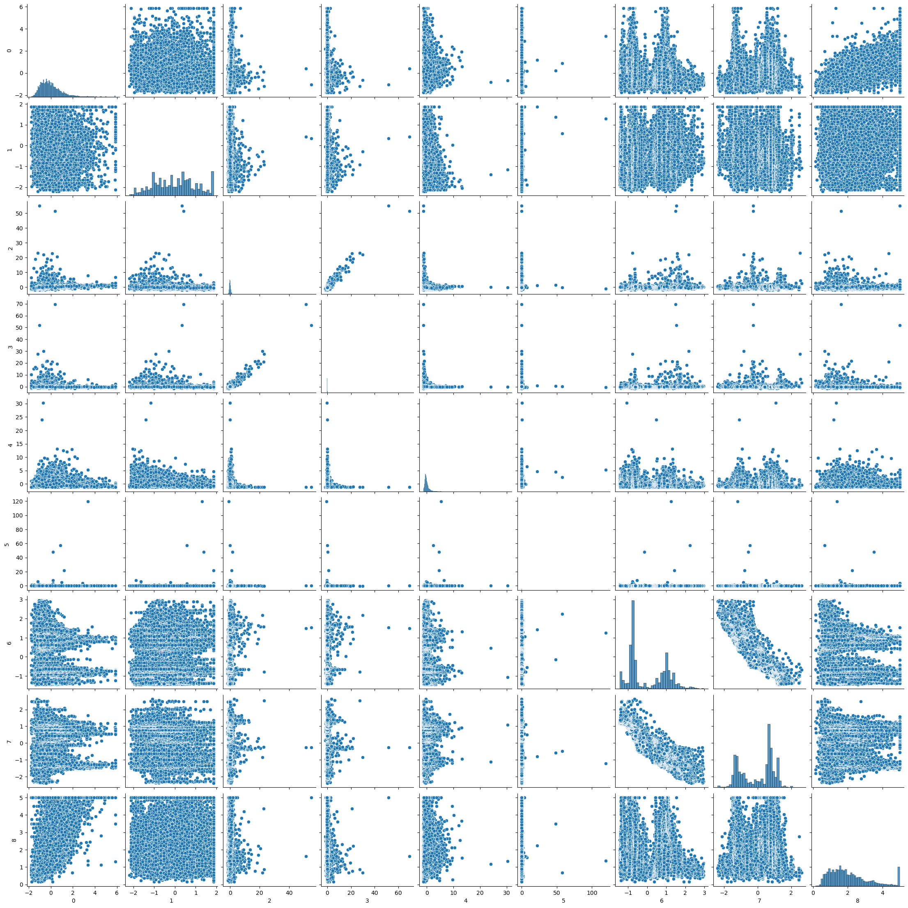
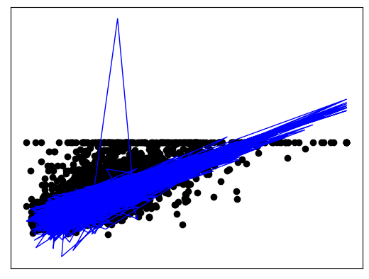

```python
!pip install sklearn

```

    Collecting sklearn
      Downloading sklearn-0.0.post1.tar.gz (3.6 kB)
      Preparing metadata (setup.py) ... [?25ldone
    [?25hBuilding wheels for collected packages: sklearn
      Building wheel for sklearn (setup.py) ... [?25ldone
    [?25h  Created wheel for sklearn: filename=sklearn-0.0.post1-py3-none-any.whl size=2936 sha256=9fcb1af51c7f75a10724e6baefa19e5013aeee263a6cc8bcc2c8461acad32fd2
      Stored in directory: /Users/nguyenlinhchi/Library/Caches/pip/wheels/f8/e0/3d/9d0c2020c44a519b9f02ab4fa6d2a4a996c98d79ab2f569fa1
    Successfully built sklearn
    Installing collected packages: sklearn
    Successfully installed sklearn-0.0.post1


```python
from sklearn.datasets import fetch_california_housing
from sklearn.preprocessing import StandardScaler
from sklearn import linear_model
import matplotlib.pyplot as plt
import seaborn as sns
import numpy as np
import pandas as pd
from sklearn.model_selection import train_test_split
from sklearn.metrics import mean_squared_error, r2_score

```


```python
california_housing = fetch_california_housing(as_frame=True)
california_housing.data.head()
```


<div>
<style scoped>
    .dataframe tbody tr th:only-of-type {
        vertical-align: middle;
    }

    .dataframe tbody tr th {
        vertical-align: top;
    }

    .dataframe thead th {
        text-align: right;
    }
</style>
<table border="1" class="dataframe">
  <thead>
    <tr style="text-align: right;">
      <th></th>
      <th>MedInc</th>
      <th>HouseAge</th>
      <th>AveRooms</th>
      <th>AveBedrms</th>
      <th>Population</th>
      <th>AveOccup</th>
      <th>Latitude</th>
      <th>Longitude</th>
    </tr>
  </thead>
  <tbody>
    <tr>
      <th>0</th>
      <td>8.3252</td>
      <td>41.0</td>
      <td>6.984127</td>
      <td>1.023810</td>
      <td>322.0</td>
      <td>2.555556</td>
      <td>37.88</td>
      <td>-122.23</td>
    </tr>
    <tr>
      <th>1</th>
      <td>8.3014</td>
      <td>21.0</td>
      <td>6.238137</td>
      <td>0.971880</td>
      <td>2401.0</td>
      <td>2.109842</td>
      <td>37.86</td>
      <td>-122.22</td>
    </tr>
    <tr>
      <th>2</th>
      <td>7.2574</td>
      <td>52.0</td>
      <td>8.288136</td>
      <td>1.073446</td>
      <td>496.0</td>
      <td>2.802260</td>
      <td>37.85</td>
      <td>-122.24</td>
    </tr>
    <tr>
      <th>3</th>
      <td>5.6431</td>
      <td>52.0</td>
      <td>5.817352</td>
      <td>1.073059</td>
      <td>558.0</td>
      <td>2.547945</td>
      <td>37.85</td>
      <td>-122.25</td>
    </tr>
    <tr>
      <th>4</th>
      <td>3.8462</td>
      <td>52.0</td>
      <td>6.281853</td>
      <td>1.081081</td>
      <td>565.0</td>
      <td>2.181467</td>
      <td>37.85</td>
      <td>-122.25</td>
    </tr>
  </tbody>
</table>
</div>


```python
X = california_housing.data
y = california_housing.target
scaler = StandardScaler()
X_scaled = scaler.fit_transform(X)
y_new=np.array(y).reshape(-1,1)
data=np.append(X_scaled, y_new, axis=1)
data=pd.DataFrame(data)
sns.pairplot(data)
plt.show()
```


    

    


```python
X_train, X_test, y_train, y_test = train_test_split(X_scaled, y, test_size=0.2, random_state=42)
regr = linear_model.LinearRegression()
regr.fit(X_train,y_train)
regr.coef_
y_pred=regr.predict(X_test)
print(mean_squared_error(y_test, y_pred))
print(r2_score(y_test,y_pred))
```

    0.555891598695244
    0.5757877060324511


```python
plt.scatter(X_test[:,0], y_test, color="black")
plt.plot(X_test[:,0], y_pred, color="blue", linewidth=1)
plt.xticks(())
plt.yticks(())
plt.show()
```


    

    


```python
def gradient_descent(W, x, y):
    y_hat = x.dot(W).flatten()
    error = (y - y_hat)
    mse = (1.0 / len(x)) * np.sum(np.square(error))
    gradient = -(1.0 / len(x)) * error.dot(x)
    return gradient, mse
w = np.array((10,10,10,10,10,10,10,10))
alpha = .1
tolerance = 1e-3
 
old_w = []
errors = []
```


```python
# Gradient Descent
iterations = 1
for i in range(200):
    gradient, error = gradient_descent(w, X_scaled, y)
    new_w = w - alpha * gradient
 
    # Print error every 10 iterations
    if iterations % 10 == 0:
        print("Iteration: %d - Error: %.4f" % (iterations, error))
        old_w.append(new_w)
        errors.append(error)
 
    # Stopping Condition
    if np.sum(abs(new_w - w)) < tolerance:
        print('Gradient Descent has converged')
        break
 
    iterations += 1
    w = new_w
 
print('w =', w)
```

    Iteration: 10 - Error: 87.8141
    Iteration: 20 - Error: 29.5025
    Iteration: 30 - Error: 18.4665
    Iteration: 40 - Error: 15.1451
    Iteration: 50 - Error: 13.5619
    Iteration: 60 - Error: 12.4791
    Iteration: 70 - Error: 11.6017
    Iteration: 80 - Error: 10.8480
    Iteration: 90 - Error: 10.1882
    Iteration: 100 - Error: 9.6070
    Iteration: 110 - Error: 9.0935
    Iteration: 120 - Error: 8.6392
    Iteration: 130 - Error: 8.2366
    Iteration: 140 - Error: 7.8793
    Iteration: 150 - Error: 7.5620
    Iteration: 160 - Error: 7.2797
    Iteration: 170 - Error: 7.0284
    Iteration: 180 - Error: 6.8043
    Iteration: 190 - Error: 6.6042
    Iteration: 200 - Error: 6.4255
    w = [ 1.82152727  0.51084912 -1.75407177  1.36706096  0.12526811 -0.093646
      2.88974467  2.82229194]


```python
regr.coef_
```


    array([ 0.85238169,  0.12238224, -0.30511591,  0.37113188, -0.00229841,
           -0.03662363, -0.89663505, -0.86892682])


